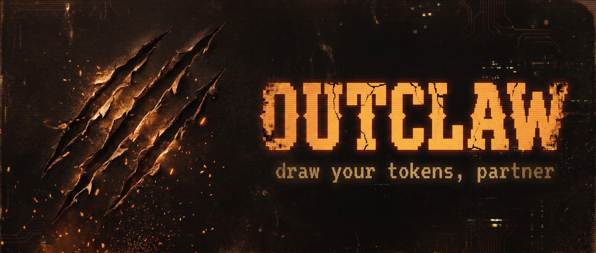

<p align="center">
  
</p>

A mini [OpenClaw](https://github.com/openclaw/openclaw) — autonomous AI agent powered by the Claude Agent SDK.

## Why

OpenClaw is powerful but bloated — most features go unused and reliability suffers. outclaw strips it down to what actually matters.

The key difference is the engine: outclaw runs on the **Claude Agent SDK** instead of Pi, so there is no API key or per-token billing — just a Claude subscription. 

The SDK handles the agent loop and built-in tools, **skill system** extends the agent's abilities on top of that foundation.

outclaw now runs as a multi-agent daemon. Each agent has its own workspace,
prompt files, sessions, heartbeat, and cron jobs under
`~/.outclaw/agents/<name>/`, while shared infra stays at the root.

<!-- TODO: more on philosophy -->

## Features

- Multi-agent daemon with one long-lived runtime per agent workspace
- Terminal UI with markdown rendering, session picker, and multiline composer
- Telegram bot with the same capabilities, synced to the same agent runtime
- `/agent` switching in both TUI and Telegram
- Periodic heartbeat prompts injected into the active agent session
- Parallel cron jobs running independent agent instances on a schedule
- State-changing commands (model, effort, session) stay in sync across all connected frontends bound to the same agent

<!-- TODO: more features -->

## Setup

```sh
git clone https://github.com/YishenTu/outclaw.git
cd outclaw
bun install
bun link
```

Run `oc start` or `oc dev` once to create `~/.outclaw/`, onboard the first
agent, and seed its workspace under `~/.outclaw/agents/<name>/`.

Optional Telegram setup:

- Store per-agent Telegram settings in root `~/.outclaw/config.json` under
  `agents.{agent_id}.telegram`
- Use literal values or `$ENV_VAR` references for `telegram.botToken`
- Use an array or a `$ENV_VAR` reference for `telegram.allowedUsers`
- Put those referenced env vars in the shell environment or in `~/.outclaw/.env`
- Use `oc config secure` to extract hardcoded Telegram secrets into `.env`

## Stack

- [Bun](https://bun.sh) — runtime & package manager
- [@anthropic-ai/claude-agent-sdk](https://www.npmjs.com/package/@anthropic-ai/claude-agent-sdk) — agent backend
- [Ink](https://github.com/vadimdemedes/ink) — terminal UI
- [grammY](https://grammy.dev) — Telegram bot
- TypeScript (strict mode)

## License

MIT
