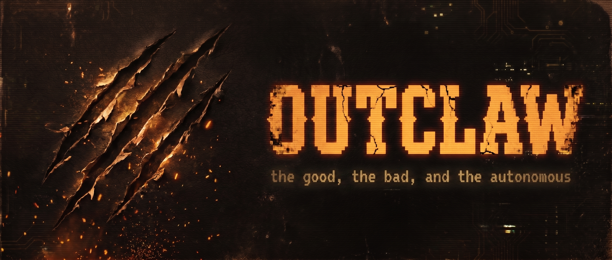

<p align="center">
  
</p>

A mini [OpenClaw](https://github.com/openclaw/openclaw): a local-first, multi-agent autonomous runtime with browser and TUI interfaces, plus remote access through Telegram.

Chat runs through [Pi](https://github.com/badlogic/pi-mono). Code mode acts as a Codex client, and the delegation flow lets a chat agent shape a task before handing focused instructions to a coding agent.

Memory is file-first instead of transcript-first: each agent workspace is an [Obsidian](https://obsidian.md/) vault (Obsidian required) containing durable memory files routed through indexes and woven together with `[[wikilinks]]`. Cron jobs, heartbeats, tools, and skills automate capture, curation, and synthesis.

Extend an agent's abilities by adding skills to its workspace.

## Setup

```sh
git clone https://github.com/YishenTu/outclaw.git
cd outclaw
bun install
bun link
```

Then ask your agent to run `oc -h`.

## License

MIT
